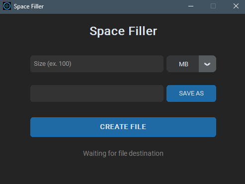

# SpaceFiller 💽

A modern desktop application built with Python and CustomTkinter designed to create dummy files of precise sizes.

Useful for testing disk storage behavior, verifying network transfer speeds of large files, or reserving disk space.



## Features

* **Modern UI:** Clean interface built with CustomTkinter (system theme aware).
* **Flexible Units:** Supports file creation in **MB** and **GB**.
* **Visual Feedback:** Includes a real-time progress bar for large file operations.
* **Portable:** Available as a standalone `.exe` for Windows, requiring no installation.

## Quick Start

No Python knowledge is required to use this tool.

1.  Go to the **[Releases](../../releases/latest)** page on this repository.
2.  Download the `SpaceFiller.exe` file from the "Assets" section.
3.  Double-click to run. It's portable, so no installation is needed.

## Development (Building from source)

If you want to run the raw Python script or build the EXE yourself.

### Requirements

* Python 3.13+
* `pip install customtkinter pillow packaging darkdetect`

### Running the script

```bash
git clone https://github.com/v-camon/SpaceFiller.git
cd SpaceFiller
python SpaceFiller.py